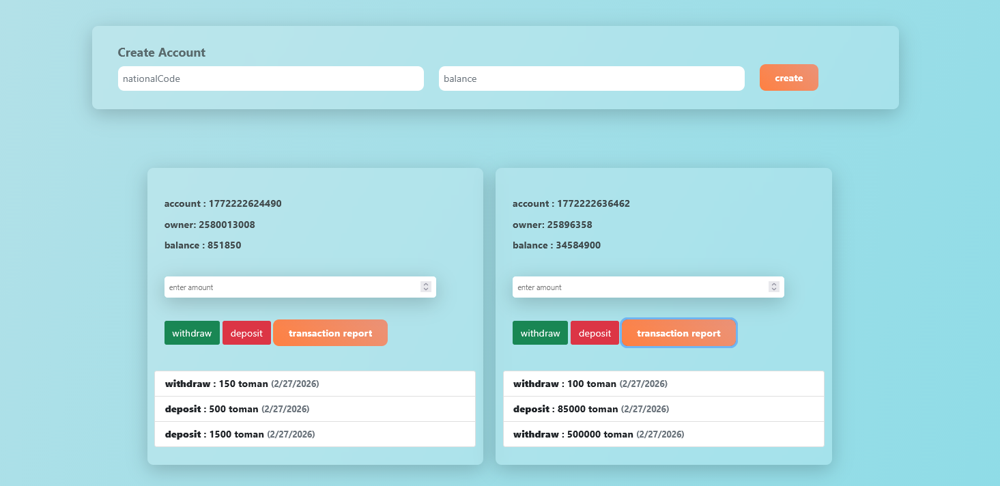

 
🏦 MiniBank – OOP Banking System (Vanilla JavaScript)

MiniBank is a modular banking simulation built with Object-Oriented Programming (OOP) using Vanilla JavaScript.

This project was developed to demonstrate real-world frontend architecture, state management, and clean separation of concerns — similar to how scalable applications are structured in production environments

---

 
✨ Key Features

Create bank accounts

Deposit funds

Withdraw funds

View transaction history

Persistent storage using LocalStorage

Dynamic UI rendering (without reload)

Modular ES6 architecture

Fully OOP-driven logic

---

 
🧠 Architecture Overview

The application is designed using a layered structure to simulate real-world system design.

🔹 Account (Domain Layer)

Represents a real bank account.

Handles:

Balance logic

Deposit / Withdraw operations

Transaction history

Encapsulates business rules such as:

Prevent invalid transactions

Prevent overdraft

Track financial activity

---

 
🔹 Bank (Service Layer)

Acts as the system manager.

Responsible for:

Managing all accounts

Data persistence

State restoration

Implements:

LocalStorage sync

Data mapping

System-wide state management

---

 
🔹 UI (Presentation Layer)

Handles all DOM interactions.

Responsibilities:

Rendering accounts

Showing alerts

Displaying transaction history

User interaction feedback

This keeps business logic independent from UI logic — a critical practice in scalable applications

---

 
🧩 Concepts Demonstrated

This project showcases practical understanding of:

Object-Oriented Programming in JavaScript

ES6 Modules

Separation of Concerns

State Management

Data Persistence

DOM Manipulation

Clean Code Structure

---

 
💾 Data Persistence

All accounts and transactions are stored using:
localStorage

Data is automatically restored on reload using:
restoreFromLocalStorage()

---

 
🎯 Why This Project is Valuable for Hiring

MiniBank is not just a UI demo.

It reflects:

✔ Real-world class design
✔ Business logic encapsulation
✔ Maintainable architecture
✔ Scalable structure
✔ Frontend state modeling

This mirrors how modern frontend applications separate:
| Layer   | Responsibility |
| ------- | -------------- |
| Model   | Account        |
| Service | Bank           |
| View    | UI             |

---

 
🛠 Tech Stack

HTML5

CSS3

Bootstrap

Vanilla JavaScript (ES6)

OOP Design Pattern

LocalStorage API

---

 
🔮 Future Improvements

Money transfer between accounts

Account deletion

Account search

Backend integration

Authentication system

----

 
🚀 Live Demo

https://sepid-dev.github.io/miniBank/

---

 
📸 Preview 

---

 
👨‍💻 Author

Developed as a portfolio project to demonstrate job-ready frontend architecture and OOP skills
